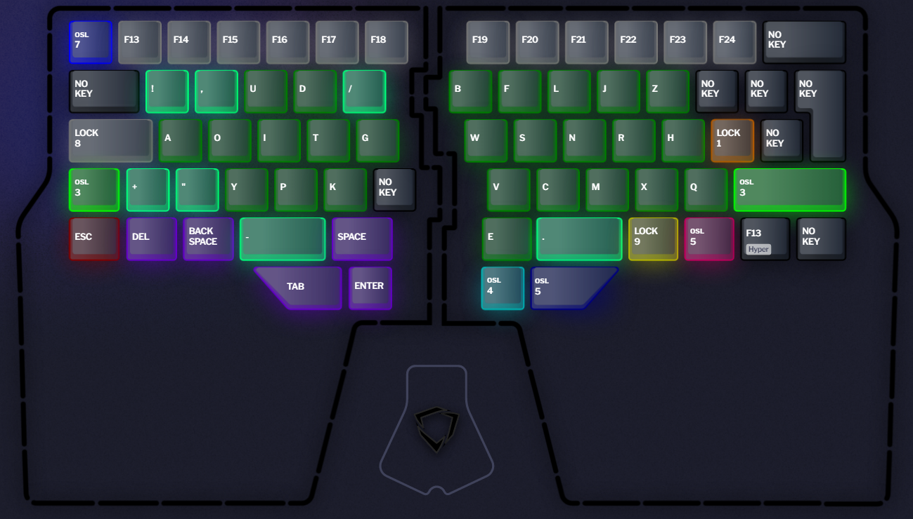
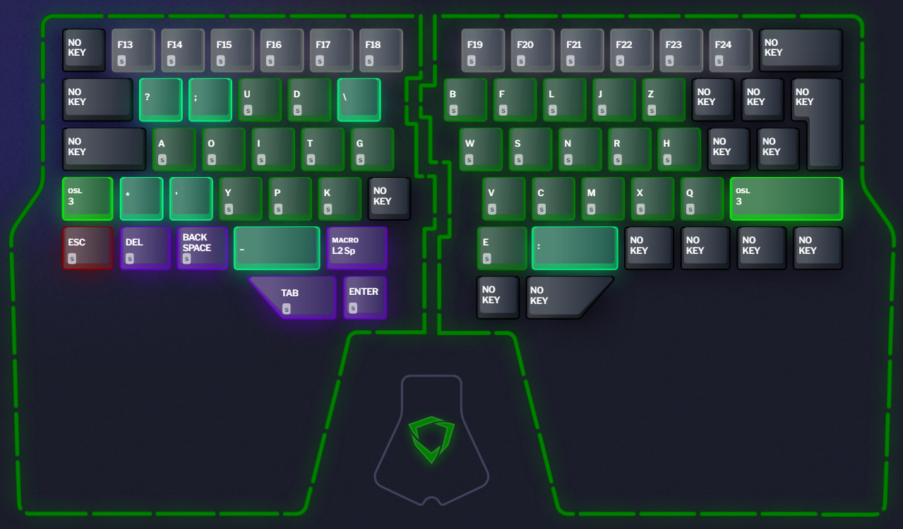
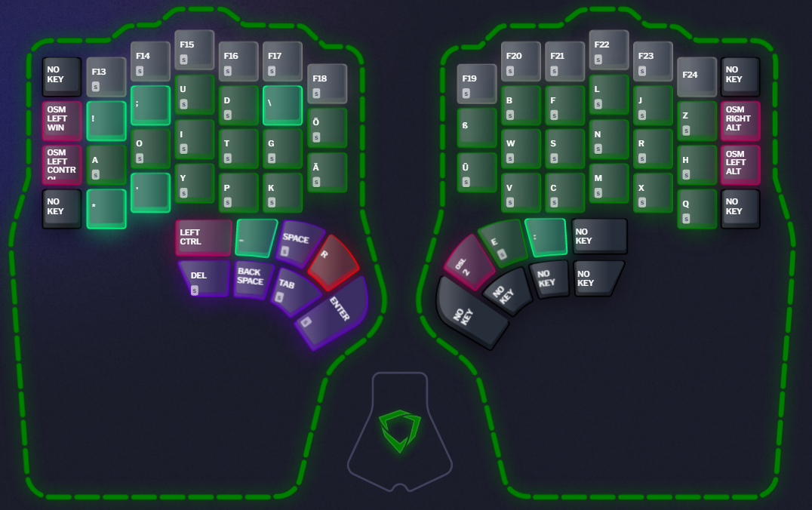
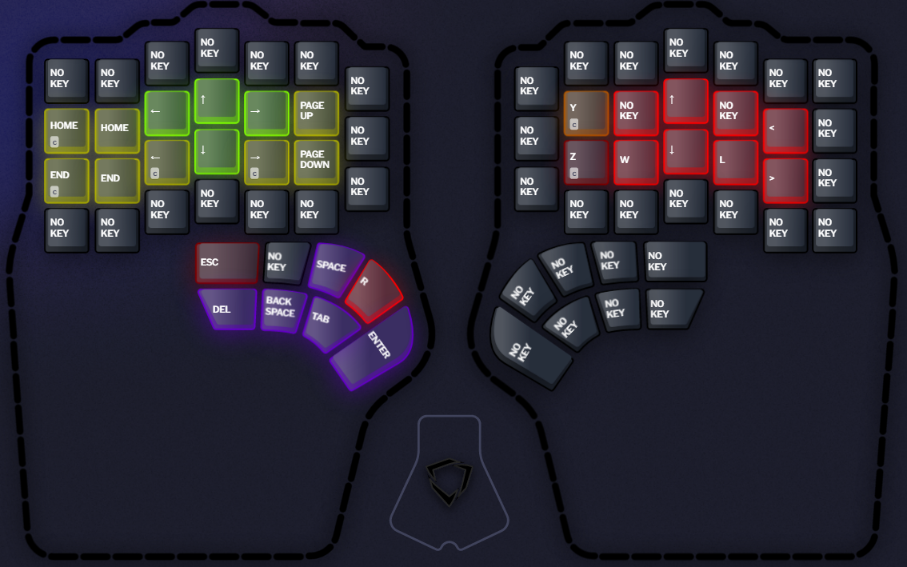
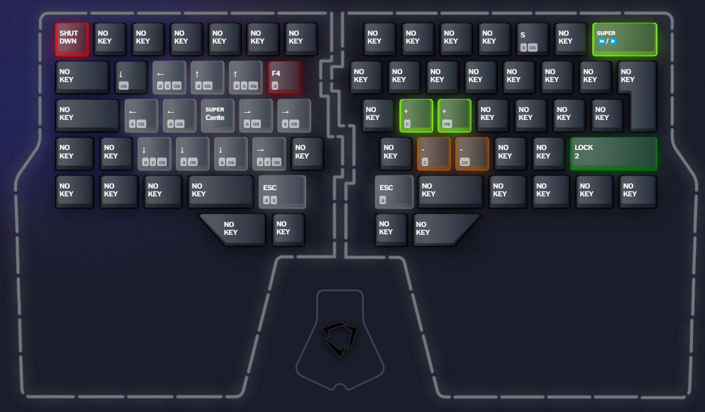

# Raise and Defy Layers
- Going to  use those Layers for programming.
- I think Key sequences are superior to Key Chords -> OneShotKeys are great 
- Things which are Marked Red will be changed to some Kind of macro. Assuming will be able to import the Raise macros to Defy(to lazy to do them for Defy aswell). Other than the R key which will be a Repeat Last Key
- When using Home Row mods hate the delay so not gonna use them. 
- Trying to avoid instantly using same side of Thumb Cluster after using a Layer swap.
- not sure if I want a dedicated exit layer button or same key which enters exits probably the latter since i want to use OneShotLayer when it makes sense
- probably will abandon raise stuff when i get my defy

## Colors

Bright Red: Keys which will be changed to Macros -> Placeholder \
Red: Esc, decreasing \
Orange: Gaming Layer \
Yellow: Arrows \
Yellow-Green: not sure yet \
Bright-Green: increasing \
Green: Typing \
Green-Blue: Typing Symbols \
Light-Blue: Symbols \
Blue-Green: Math Symbols \
Bright-Blue: F Keys \
Blue: Math/Numbers \
Purple: Textmodify \
Pink: modifier\
Grey: not sure yet\
Black: Nothing 

## Typing 

Based on https://www.keyboard-design.com/best-ergo-layouts-all.html
To be specific: maks-ex.en.ergodox

Used https://www.keybr.com to learn it. Felt great to type while learning it so gonna stick to this one.

- Swap to Number Layer as OSL since most of the time you just need 1 or 2 numbers before swapping back. Same goes for Symbols in Programming.
- Want to consolidate the modifiers, other than shift, into own layer. But only if it is possible to do OSL -> OSM. \
This currently just goes into timeout without switching back to Layer on OSM press. 
- F13-F24 gonna be Macros. Also conssidering changing this to Numbers
- double tap of OSL to shift typing for capslock

## Shift Typing 

- extra layer for this since i want to change the shift behaviour for some symbols
- When using Capslock majority of times you want to use it only for 1 word so Macro on Space which returns to normal typing Layer.

## Python

Super keys of the math symbols are of form\
Press: +\
Hold: +=\
- Symbols are on left thumbcluster since right thumb changes to this Layer.

## Number

- Lower numbers are used more often than higher ones, especially 0 and 1 in programming.
- Prefering a row to Numpad style.
- Logic in placing the number is strongest to weakest finger. Left are even and Right are odd Numbers.
- Also added hex for color picking etc.
- Not yet sure if I want a OSL to Math symbol Layer or if I'm gonna put them into this Layer 
## Symbol Number

- like I said not yet sure how to do it 
## Arrow/Textediting

- Top is going out of document (up/left)
- Bottom is going into (down/right)
- Trying it like this since there is never a reason to press left and right at the same time. Also applies for up and down.\
So putting them on the same finger seems logical. 
- Probably going back to inverted T style arrow keys.
## F-keys

- not sure how to order them yet
- also add modifiers?

## Window

- keybinds based on https://github.com/ahmetb/RectangleWin
- prob gonna write my own tool at some point

## Gaming

- using normal qwertz on raise, but will be using shifted over qwertz on Defy

## Macros

- stopped using some
## Superkeys

- mostly using just using tap, hold
- also stopped using some 
## Stuff you should Checkout
http://xahlee.info/kbd/keybinding_index.html \
https://www.youtube.com/watch?v=yiwUjLaebuw \
https://www.youtube.com/@BenVallack/videos \
https://www.youtube.com/@BenVallacksKeyboards/videos \
https://forum.colemak.com/topic/2014-extend-extra-extreme/ 